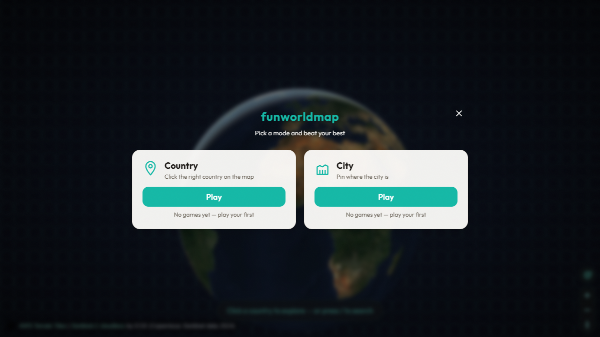

# funworldmap

> **[Live demo →](https://funworldmap.com)** · Interactive political world map with country-pinning and city-guessing games.



[](https://github.com/GranatenUdo/funworldmap/actions/workflows/ci.yml)
[](LICENSE)

Free, interactive political world map. Explore countries, borders, and geopolitical facts through a map-first interface — and beat your personal best in two geography game modes.

- 195 sovereign states (193 UN members + Vatican + Palestine), with data from REST Countries and CIA World Factbook archive
- Fuzzy search by name, capital, region, or country code
- Per-field source attribution (every data point shows where it came from)
- Satellite imagery + 3D terrain by default, with a one-tap switch to a clean vector map
- Light/dark/system theme with basemap adaptation
- WCAG AA accessible: keyboard navigation, screen reader support, skip links
- Client-side SPA — deployable to any static host; no application backend required to run it (an optional, cookieless analytics Worker records anonymous usage counts — see [docs/systems/analytics.md](docs/systems/analytics.md))
- **Country Pinning** — click the right country; three lives, unlimited rounds, personal-best tracked
- **City Guessing** — pin where the city is; 10 rounds, distance-scored, personal-best tracked

## Development

```bash
npm install
npm run dev           # Start dev server at localhost:5173
npm run build         # Type-check and produce production build
npm run test:e2e      # Run Playwright end-to-end tests
npm run test:unit     # Run Vitest unit tests
npm run lint          # Check for lint errors
npm run format        # Format source files with Prettier
npm run update-data   # Regenerate countries.json from source APIs
```

No content-generation step is required before building or running tests — the app is fully client-side.

## Architecture

- **Map**: MapLibre GL JS — satellite imagery (EOX Sentinel-2) with 3D terrain by default; OpenFreeMap vector tiles (Positron) as the toggle-off map view
- **Data**: REST Countries v3.1 + CIA World Factbook archive, merged with field-level source attribution; rendered set filtered to the canonical 195
- **Search**: Fuse.js fuzzy search with weighted fields
- **Stack**: Vite 8 (Rolldown), React 19, TypeScript, Tailwind CSS 4
- **Testing**: Playwright e2e (ANGLE-backed WebGL2 — real GPU with software fallback), Vitest unit tests

## Documentation

See [docs/index.md](docs/index.md) for the full system design documentation.

## Contributing

See [CONTRIBUTING.md](CONTRIBUTING.md) for setup, PR expectations, and how to propose a new data source.

## Security

See [SECURITY.md](SECURITY.md) for reporting procedure.

## Decision Records

Architectural decisions live under [docs/adr/](docs/adr/). See [docs/adr/README.md](docs/adr/README.md) for filing conventions.

## Operations

See [docs/ops/runbook.md](docs/ops/runbook.md) for bandwidth watch, data freshness cadence, basemap degradation handling, and incident response.

## Error reporting

Production builds can report runtime errors to Sentry. To enable:

1. Create a project at https://sentry.io/ and copy its DSN.
2. In this repo, go to Settings → Secrets and variables → Actions and add a new repository secret:
   - Name: `VITE_SENTRY_DSN`
   - Value: the DSN from step 1.
3. Trigger a new deploy (empty commit + push).

Without a DSN, the app works normally — Sentry is a no-op.

## Roadmap

See [docs/roadmap.md](docs/roadmap.md) for deferred work and architectural direction.

## License

Source code is MIT licensed — see [LICENSE](./LICENSE).

Data, fonts, and flag assets retain their upstream licenses; see [docs/systems/data.md](docs/systems/data.md) for source-by-source attribution.
