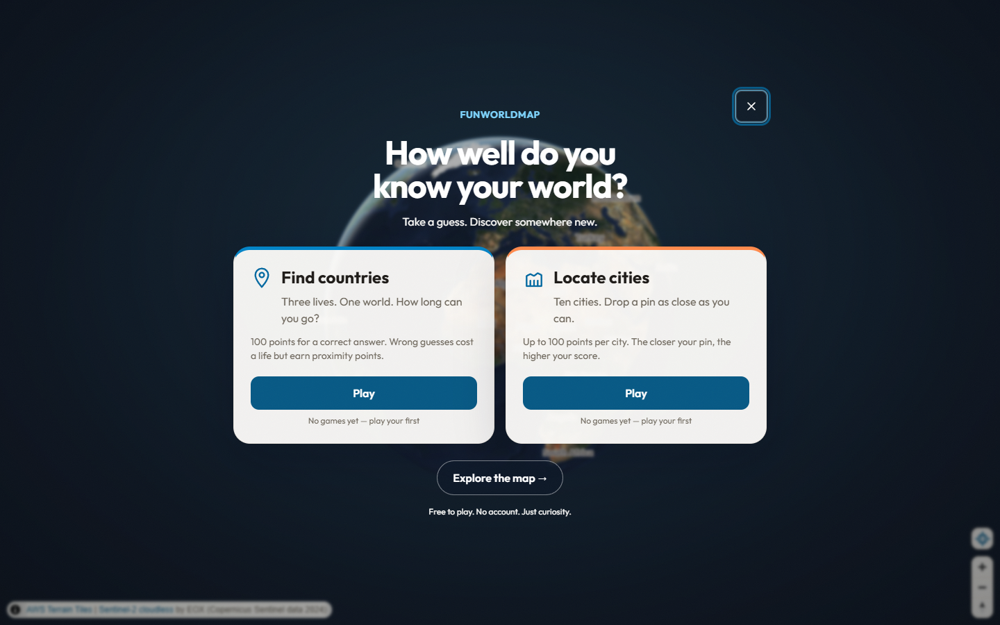
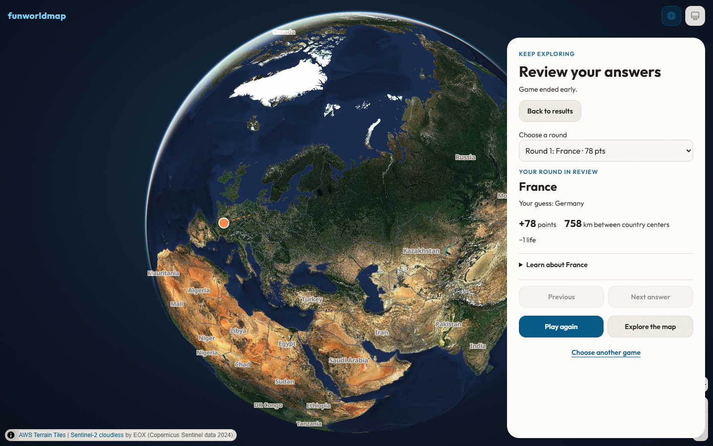

# Playful geography — verification and review

Implemented on `codex/playful-geography`; production reconciliation baseline `1599702`. Visual approval remains the merge/deployment gate.

## Independent reviews

- Plan: one GPT-6 Astra agent at medium reasoning, `/root/adversarial_plan_review`. Nine concrete implementation-contract findings addressed in the committed plan before coding.
- Final code: one GPT-6 Astra agent at medium reasoning, `/root/redesign_code_review`, reviewed `1599702..e87d4c1`. Four important findings fixed with reproducing tests: completed-session recovery, replay camera cancellation, results recovery affordances, responsive review positioning. No deferred minors. Fixes verified through tests, not a second reviewer.

## Verification (2026-10-03)

- `npm run check`: lint and typecheck clean; **684 unit tests passed** in 86 files.
- `E2E_PORT=5188 npx playwright test --workers=2 --reporter=line`: **234 passed** in the final complete run (2.2 minutes). Covers desktop Chromium, mobile Chromium, WebKit, Firefox touch, and the separate local visual-evidence project. No additional skips or retries used to make this run pass.
- `npm run build`: production build succeeded. Existing large MapLibre bundle advisory remains.
- Earlier failures were fixed: duplicate inert ownership; preferred focus; offscreen mobile translation; test setup awaiting actual round/readiness; obsolete automatic-progression and mobile expand expectations; invalid label-layer fixtures. The first-load satellite test also passed 10 consecutive runs after its setup readiness fix.
- Real-map screenshots: light/dark, desktop/phone, entry/reveal/review/reference. Renderer: **ANGLE / NVIDIA GeForce RTX 5070 Ti / Direct3D11**. Tiles and camera settled before captures. Browser tests also cover 568×320 landscape and resized historical review.

## Bundle comparison

Same compiler/dependencies, production JS assets including mandatory geometry chunks:

| Build | Raw bytes | Calculated gzip bytes |
|---|---:|---:|
| Reconciled baseline | 2,603,005 | 704,323 |
| Redesign | 2,610,068 | 707,215 |

Delta: +2,892 calculated-gzip bytes (+0.41%). These are asset compression calculations, not HTTP transfer, frame-rate, energy, or Core Web Vitals measurements. No performance speedup is claimed.

## Decisions retained during implementation

- Replay resets instantly to the canonical world view; a prior reveal cleanup cannot cancel it. This trades the replay transition's flight animation for deterministic placement.
- Historical answers use zero-duration camera placement with panel-aware offsets. Resize recenters the selected answer rather than preserving an offset that can hide it.
- Retry from results never schedules a fallback reload, so failed recovery cannot silently discard in-memory review. The ordinary map retry retains its existing reload fallback.
- Kept the documented Fuse search threshold of 0.3. Updated a stale test to the supported low-error typo `Germani`; short transpositions such as `Untied` are not guaranteed.
- Root chooser dismissal lasts this page lifetime. Deep links bypass it; Explore dismisses it; Choose another game opens it explicitly. Existing routes and best-score keys remain compatible.
- Round history is in memory only. Existing game scoring and the deliberate pointer-only spatial-guess scope remain unchanged.

## Visual evidence

## Release-gate correction (2026-10-03)

CI's browser shards passed, but CSS was 100 gzip bytes over its existing budget and CodeQL flagged dev-only regex HTML stripping. The same designated Astra-medium plan reviewer checked the narrow correction before edits. Tailwind now scans only runtime src/index templates; analytics uses Vite's escaped tag descriptor, emitted only for builds with a nonblank token. Five real-HTML-build tests cover gating and special-character attribute round-trip.

Validation: lint/type/unit passed (689 tests); CSS budget 21,947 / 24,000 gzip bytes, all budgets unchanged and passing. Targeted responsive/dark/review browser smoke also passed after the correction. Merge remains gated on the new commit's CI and CodeQL results.

The real-tile capture initially encountered a basemap notice over mobile navigation. Its helper now dismisses only an accessible (non-inert) notice and waits for removal. The capture then passed on the RTX 5070 Ti; the 37 interaction smoke cases also passed.
